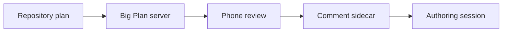

# Big Plan Plugin Example

This promoted example exercises the Big Plan review UI, including an optional note attached to a selected decision.

> [!NOTE]
> Comment on any anchored block, react from the rail, and use the controls below to verify the phone review flow.

## Review Checklist

- [x] Preserve the existing renderer and UI assets byte-for-byte
- [ ] Choose a rollout option
- [ ] Choose a decision and add a note
- [ ] Send one feedback batch to the authoring session

## Delivery Flow



## One Choice

```decide
How should this example be checked?
- Review it over the current Tailscale connection
- Review it from localhost
```

## Several Choices

```decide-multi
Which interactions should we exercise?
- Add an anchored comment
- Toggle a task checkbox
- Choose a decision
- Choose a decision and add a note
- Send the feedback batch
```

## Decision Note Test

Choose **Review in stages**, then add a note such as: `Start with the phone flow; I will test the desktop layout tomorrow.` Blur the note field or press Ctrl/Cmd+Enter. Refresh the page and confirm both the selection and note remain. Change the selection and verify the note follows that decision; clearing the selection clears its saved note too.

```decide
How should this note interaction be tested?
- Review in stages
- Review everything now
```

## Compare the Access Paths

<div class="compare">
<div class="compare-col" markdown="1">
### Tailscale

- Available from another tailnet device
- Hostname is derived dynamically
- The launcher binds to `0.0.0.0` only while Tailscale is available
</div>
<div class="compare-col" markdown="1">
### Localhost

- Always the fallback
- Bound to `127.0.0.1`
- No remote network dependency
</div>
</div>

## Capability Matrix

| Surface | Source of truth | Reviewer action |
| --- | --- | --- |
| Tasks | Markdown | Toggle checkbox |
| Decisions | Comment sidecar | Select options |
| Revisions | Snapshot sidecar | Review or accept diff |

## Operator Command

```sh
systemctl --user status big-plan.service
```

The command block is intentionally inert documentation; the plugin does not activate the service merely by being installed.
